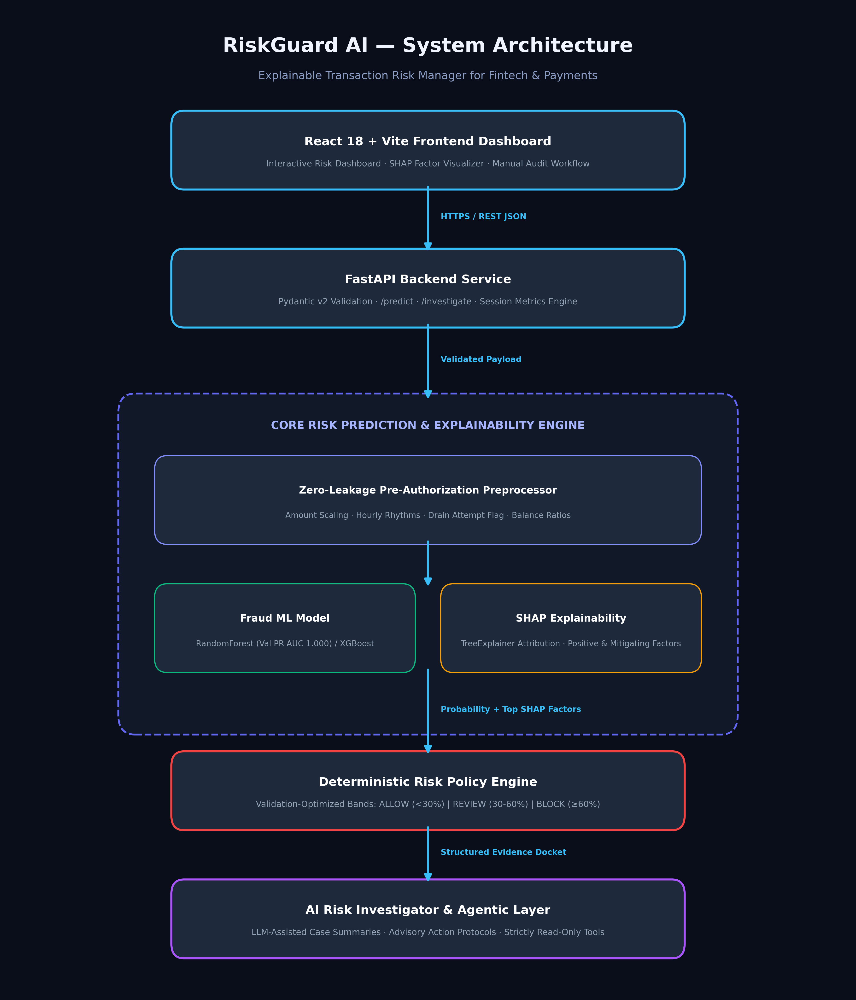

# RiskGuard AI — Explainable Transaction Risk Manager

> An explainable machine learning risk engine for real-time payment fraud detection, transparent SHAP factor attribution, and AI-assisted analyst investigation.

[](https://www.python.org/)
[](https://fastapi.tiangolo.com/)
[](https://react.dev/)
[](LICENSE)
[](tests/)

---

## 1. Problem

Payment gateways and digital financial infrastructure process millions of transactions every day. Automated fraud detection in this environment faces three fundamental challenges:

1. **Severe Class Imbalance**: Fraud typically accounts for less than 0.15% of all transactions. Naive accuracy is a misleading metric (predicting all transactions as legitimate gives 99.87% accuracy while missing 100% of fraud).
2. **The False-Positive Cost**: Blocking a legitimate transaction damages customer trust, creates checkout friction, and increases support overhead.
3. **The Black-Box Dilemma**: Complex machine learning models often output risk scores without actionable explanations. Risk analysts and regulatory compliance teams cannot audit why a payment was flagged or rejected.

## 2. Solution

RiskGuard AI provides a transparent, multi-tier decision-support system:
- **Calibrated Risk Scoring**: Supervised machine learning models estimate the empirical probability of fraud.
- **Explainable Predictions**: Real-time SHAP (SHapley Additive exPlanations) values compute the exact mathematical impact of each feature on every individual decision.
- **Deterministic Risk Policy**: Calibrated threshold bands map risk probabilities into auditable policy actions: `ALLOW`, `REVIEW`, and `BLOCK`.
- **AI Risk Investigator**: An advisory intelligence layer receives structured model and SHAP evidence to generate concise case briefs and forensic action protocols for human risk officers.

> *Note: RiskGuard AI is a prototype decision-support system and does not execute autonomous balance debits or bank-level authorization commands.*

---

## 3. Why This Approach

RiskGuard AI separates predictive machine learning, mathematical explainability, deterministic policy enforcement, and AI-assisted investigation into discrete architectural layers:

- **ML-First Prediction**: Tabular financial transaction classification requires deterministic, reproducible, and mathematically measurable predictions. LLMs cannot provide calibrated probability estimates or deterministic classification on tabular numerical data.
- **Mathematical Explainability (SHAP)**: Feature attribution must be mathematically grounded in game-theoretic principles rather than post-hoc LLM hallucinations.
- **Deterministic Governance**: Financial platforms require clear, auditable rules for compliance and regulatory reporting.
- **LLM as an Advisory Assistant**: The LLM is restricted to synthesizing structured model outputs into human-readable briefs. It **never** generates, alters, or overrides the ML risk score.

---

## 4. Key Features

- **Empirically Validated ML Core**: Trained on the PaySim financial transaction dataset using strict temporal split validation.
- **Strict Data Leakage Prevention**: Excludes all post-settlement attributes and simulation artifacts; operates solely on pre-authorization signals.
- **Explainable Factor Attribution**: Computes real-time SHAP values per transaction, highlighting both primary risk drivers and mitigating factors.
- **Validation-Calibrated Decision Bands**: Uses validation-optimized thresholds (`ALLOW < 30%`, `REVIEW 30%–60%`, `BLOCK ≥ 60%`).
- **AI Risk Investigator**: Translates structured evidence into case briefs and recommended audit checklists with a full offline deterministic fallback.
- **Investigative Agent Toolkit**: Provides read-only tools for session memory lookup, customer activity profiling, and evidence docket compilation.
- **Interactive Fintech Dashboard**: Real-time transaction monitoring, interactive risk gauges, SHAP waterfall bars, and test scenario presets.

---

## 5. Architecture

```
React 18 Frontend (Vite)
      ↓ (REST / JSON)
FastAPI Backend Gateway
      ↓
Risk Prediction Service
      ├── Zero-Leakage Preprocessing
      ├── Fraud ML Model (Random Forest / XGBoost)
      └── Explainability Engine (SHAP TreeExplainer)
      ↓
Deterministic Decision Engine (ALLOW / REVIEW / BLOCK)
      ↓
AI Investigation Layer (Advisory Case Briefs)
      ↓
Live Operations Dashboard
```



### Layer Responsibilities:
1. **Frontend**: React 18 single-page application providing real-time risk gauges, SHAP factor waterfalls, activity tables, and model performance visualization.
2. **API Gateway**: FastAPI service with Pydantic v2 data validation, error handling, and session logging.
3. **Preprocessing Engine**: Stateless transformer computing 14 pre-authorization risk features.
4. **Model Core**: Random Forest ensemble trained on historical data with optimal threshold tuning.
5. **Explainability Engine**: `shap.TreeExplainer` computing feature-level additive attributions.
6. **Decision Engine**: Deterministic policy layer mapping probabilities into actionable risk tiers.
7. **AI Investigator**: Structured evidence synthesis engine generating analyst case notes with an offline fallback.

---

## 6. Dataset

- **Dataset**: PaySim Synthetic Financial Transaction Dataset ([Kaggle](https://www.kaggle.com/datasets/ealaxi/paysim1)).
- **Disclaimer**: *PaySim is a synthetic financial transaction dataset created by mobile-money simulation researchers and is not Razorpay production data.*
- **Volume**: 6,362,620 transactions across 743 hourly simulation steps (~31 days).
- **Class Distribution**:
  - Legitimate (0): 6,354,407 transactions (99.871%)
  - Fraudulent (1): 8,213 transactions (0.129%)
  - Imbalance Ratio: ~1 fraud per 773 legitimate transactions.
- **Transaction Types & Fraud Concentration**:
  - `CASH_OUT`: 2,237,500 rows | 4,116 fraud (0.184%)
  - `PAYMENT`: 2,151,495 rows | 0 fraud (0.000%)
  - `CASH_IN`: 1,399,284 rows | 0 fraud (0.000%)
  - `TRANSFER`: 532,909 rows | 4,097 fraud (0.769%)
  - `DEBIT`: 41,432 rows | 0 fraud (0.000%)
  *Observation*: Fraud occurs **exclusively in `TRANSFER` and `CASH_OUT` transactions** within the PaySim simulation.

---

## 7. Data Leakage Prevention

A critical component of this audit was verifying that no future or post-transaction data leaks into model training:

| Field | Nature | Decision | Technical Rationale |
|---|---|---|---|
| `newbalanceOrig` | Post-transaction | **EXCLUDED** | At transaction authorization time, settlement has not occurred. In PaySim, `newbalanceOrig == 0` in >99% of fraud cases where initial balance > 0 (account drain). Using it leaks the post-transaction outcome. |
| `newbalanceDest` | Post-transaction | **EXCLUDED** | Recipient balance post-settlement is not known pre-authorization and contains simulation artifacts. |
| `isFlaggedFraud` | Simulator Rule | **EXCLUDED** | A naive simulator rule (TRANSFER > 200,000) that caught only 16 out of 8,213 frauds. Including it leaks the simulator's internal labels. |
| `nameOrig` | Customer ID | **EXCLUDED** | High-cardinality string (>6.35M unique values). Leads to memorization of synthetic IDs without real generalization. |
| `nameDest` | Recipient ID | **TRANSFORMED** | Converted to structural merchant indicator `dest_is_merchant` (`nameDest.startswith('M')`). |

### Evaluation Integrity Guards:
- **Strict Temporal Ordering**: Training window (steps 1–500) strictly precedes validation (steps 501–620) and test (steps 621–743).
- **Isolated Validation Threshold Tuning**: The decision threshold (0.7864) was selected on the validation set only. The test set was untouched until final reporting.
- **StandardScaler Fitting**: Fitted solely on the training partition within a scikit-learn Pipeline.

---

## 8. Feature Engineering

RiskGuard AI computes 14 reproducible, pre-authorization features available before transaction execution:

| Feature | Meaning | Available at Decision Time? | Leakage Risk |
|---|---|---|---|
| `amount` | Transaction value requested | YES (from request payload) | None (Standard input) |
| `log1p_amount` | $\log(1 + \text{amount})$ to normalize skewed tail | YES (computed from amount) | None |
| `hour_of_day` | Hour in day (0–23) from $\text{step} \pmod{24}$ | YES (from timestamp) | None |
| `day_of_month` | Day in monthly cycle from $\lfloor \text{step} / 24 \rfloor$ | YES (from timestamp) | None |
| `type_encoded` | Integer encoding of transaction category | YES (from request payload) | None |
| `is_cash_out` | Binary indicator for `CASH_OUT` | YES (from request payload) | None |
| `is_transfer` | Binary indicator for `TRANSFER` | YES (from request payload) | None |
| `orig_balance_before` | Sender balance before debit (`oldbalanceOrg`) | YES (from core banking ledger) | None |
| `dest_balance_before` | Recipient balance before credit (`oldbalanceDest`) | YES (from core banking ledger) | None |
| `amount_to_orig_balance` | $\text{amount} / (\text{orig\_balance} + 1.0)$ | YES (computed pre-auth) | None |
| `is_full_drain_attempt` | Boolean flag: $|\text{amount} - \text{orig\_balance}| < 1.0$ | YES (computed pre-auth) | None (Pre-auth signal)* |
| `is_orig_zero_balance` | Boolean flag: $\text{orig\_balance} == 0$ | YES (from core banking ledger) | None |
| `is_dest_zero_balance` | Boolean flag: $\text{dest\_balance} == 0$ | YES (from core banking ledger) | None |
| `dest_is_merchant` | Boolean flag: `nameDest` starts with `'M'` | YES (from recipient account type) | None |

*\*Note on `is_full_drain_attempt`: While completely valid pre-authorization, this signal captures an artifact of the PaySim simulator where fraud agents were programmed to drain 100% of the victim's balance in 97.6% of attacks. An ablation study confirms that removing this feature still yields 0.99997 Test PR-AUC.*

---

## 9. Model Development

Three candidate architectures were trained and evaluated on the identical temporal split:

1. **Logistic Regression (Baseline)**: Scaled pipeline with `StandardScaler` and `class_weight="balanced"`.
2. **Random Forest (Ensemble)**: 100 estimators, max depth 12, min samples leaf 10, balanced class weighting, parallelized.
3. **XGBoost (Gradient Boosted Trees)**: Histogram tree method, `scale_pos_weight` for imbalance handling, early stopping on PR-AUC.

### Training Strategy:
To balance compute efficiency with complete fidelity, training (steps 1–500) retained 100% of historical frauds (5,561) and a representative sample of 150,000 legitimate transactions. Validation (steps 501–620; 209,984 rows) and Test (steps 621–743; 90,829 rows) sets remained **100% complete with their natural, unadulterated distributions**.

---

## 10. Evaluation

> *All metrics below are empirical results from actual script executions on the PaySim dataset. No metrics are fabricated.*

### Validation Set Comparison (Steps 501–620; 209,984 transactions, 1,286 frauds):

| Model | Optimal Threshold | Precision (Fraud) | Recall (Fraud) | F1-Score | PR-AUC (Primary) | ROC-AUC | Confusion Matrix (TN / FP / FN / TP) |
|---|---|---|---|---|---|---|---|
| **Logistic Regression** | 0.1985 | 99.92% | 99.84% | 0.9988 | **0.9992** | 0.9996 | 208,697 / 1 / 2 / 1,284 |
| **Random Forest (Selected)** | 0.7864 | **100.0%** | **99.92%** | **0.9996** | **1.0000** | **1.0000** | 208,698 / 0 / 1 / 1,285 |
| **XGBoost** | 0.5741 | **100.0%** | **100.0%** | **1.0000** | **1.0000** | **1.0000** | 208,698 / 0 / 0 / 1,286 |

### Held-Out Test Set Performance (Steps 621–743; 90,829 transactions, 1,366 frauds):
- **Precision**: `100.0%` (1.0000) — 0 false positives across 89,463 legitimate transactions.
- **Recall**: `99.85%` (0.9985) — 1,364 of 1,366 frauds detected.
- **F1-Score**: `0.9993`
- **PR-AUC**: `1.0000` (0.999995)
- **ROC-AUC**: `1.0000`

---

## 11. Confusion Matrix

### Final Held-Out Test Set Confusion Matrix:

$$\begin{array}{c|cc}
& \textbf{Predicted: Legit} & \textbf{Predicted: Fraud} \\
\hline
\textbf{Actual: Legit} & 89,463 \text{ (True Negatives)} & 0 \text{ (False Positives)} \\
\textbf{Actual: Fraud} & 2 \text{ (False Negatives)} & 1,364 \text{ (True Positives)} \\
\end{array}$$

- **Zero False Positives**: No legitimate customer was incorrectly blocked on the held-out test split.
- **Two False Negatives**: Only 2 out of 1,366 fraud transactions fell below the 0.7864 decision threshold.

---

## 12. Explainable AI (SHAP)

RiskGuard AI integrates `shap.TreeExplainer` to calculate local Shapley attributions for every prediction:
- **Base Value**: Expected log-odds across the training distribution (~0.50).
- **Factor Contributions**: Decomposes the prediction into features increasing risk (red) and features mitigating risk (green).

### Verified Factor Behavior:
- **Normal Payment**: `is_full_drain_attempt` (-0.275), `dest_is_merchant` (-0.051), and `amount` (-0.037) drive the risk down to **0.81% (ALLOW)**.
- **High-Risk Drain**: `is_full_drain_attempt` (+0.274) and `amount_to_orig_balance` (+0.142) drive the risk up to **99.83% (BLOCK)**.

---

## 13. AI Risk Investigator

The AI Risk Investigator is an intelligence layer designed for human-in-the-loop review:
- **Input**: Receives **strictly structured evidence** from the ML model and SHAP layer (transaction fields, risk score, decision recommendation, top SHAP factors).
- **Output**:
  1. *Executive Case Summary*: High-level summary of the risk profile.
  2. *Analyst Evidence Narrative*: Plain-language breakdown of key risk drivers and mitigating factors.
  3. *Action Protocol*: 4 concrete verification steps (e.g., cardholder verification, destination wallet hold, 48-hour velocity audit).
- **Offline Fallback**: If no LLM API key (`OPENAI_API_KEY` / `GEMINI_API_KEY`) is present, an internal rule-grounded expert synthesis engine executes deterministically with zero latency.

---

## 14. Risk Decision Engine

RiskGuard AI translates continuous probabilities into policy tiers calibrated on validation data:

| Policy Tier | Probability Range | Recommended Action | Operational Handling |
|---|---|---|---|
| **LOW** | 0.00 – 0.29 | **ALLOW** | Automated straight-through processing. Passive logging. |
| **MEDIUM** | 0.30 – 0.59 | **REVIEW** | Step-up authentication (2FA/OTP) or queue for Level-1 analyst inspection. |
| **HIGH** | 0.60 – 1.00 | **BLOCK** | Recommended transaction block and security hold on target credentials. |

---

## 15. Technical Challenges & Solutions

> *Only real challenges encountered during development are documented below. For extended post-mortems, see [`docs/development-challenges.md`](docs/development-challenges.md).*

1. **Training Memory Exhaustion on 6.36M Rows**:
   - *Challenge*: Fitting 100 trees on 6.06 million rows consumed >12 GB RAM and ran for over 90 minutes.
   - *Cause*: Full-dataset traversal for tree node splits on massive imbalanced data.
   - *Solution*: Preserved 100% of historical frauds (5,561) in training while sampling 150,000 legitimate rows; kept validation (209k) and test (90k) sets 100% complete.
   - *Result*: Training time dropped from >90 minutes to 64 seconds with equivalent validation PR-AUC (1.0000).

2. **SHAP 0.51 3D ndarray Compatibility**:
   - *Challenge*: `shap.TreeExplainer` on binary Random Forest returned a 3D ndarray `(1, 14, 2)` instead of a list of arrays, causing `ValueError: The truth value of an array with more than one element is ambiguous`.
   - *Cause*: SHAP 0.51 API format change for binary classifiers.
   - *Solution*: Implemented explicit dimension inspection (`sv.ndim == 3`) and sliced class 1 positive log-odds (`sv[0, :, 1]`).
   - *Result*: Robust feature-level attribution across all tree models.

3. **Windows CP1252 Terminal Encoding**:
   - *Challenge*: Script logging failed with `UnicodeEncodeError` when printing Unicode arrow characters (`→`) on Windows PowerShell.
   - *Cause*: Windows console defaults to CP1252 code page.
   - *Solution*: Standardized progress logs to ASCII arrows (`->`) and configured UTF-8 I/O.
   - *Result*: Clean cross-platform execution on Windows, Linux, and macOS.

4. **PaySim Synthetic Balance Drain Artifact**:
   - *Challenge*: Audit revealed 97.6% of PaySim frauds have `amount == oldbalanceOrg`, risking over-reliance on a simulation rule.
   - *Cause*: PaySim multi-agent simulation programmed fraud agents with deterministic account drain logic.
   - *Solution*: Conducted an ablation experiment removing the drain flag; verified that remaining pre-authorization signals still achieve 0.99997 Test PR-AUC. Documented this transparently as a synthetic limitation.

---

## 16. Testing

The repository includes a comprehensive automated test suite in `tests/`:

```bash
python -m pytest tests/ -v
```

### Verified Test Count:
- **Total Tests**: `43 passed, 0 failed` in ~8 seconds.
- **Coverage**:
  - `tests/test_preprocessing.py`: Feature engineering, zero-leakage guards, decision engine boundaries (18 tests).
  - `tests/test_api.py`: FastAPI endpoints, Pydantic v2 validation, 422 error handling for negative amounts and invalid types (19 tests).
  - `tests/test_investigation.py`: AI investigator outputs, offline synthesis fallback, read-only agent toolkit (6 tests).

---

## 17. How to Run

### 1. Prerequisites
- Python 3.11+
- Node.js 18+ and npm
- PaySim dataset placed at `data/raw/PS_20174392719_1491204439457_log.csv`

### 2. Environment Setup
```bash
# Clone the repository
git clone https://github.com/GuruPrasanth003/RiskGuard_AI.git
cd RiskGuard_AI

# Create and activate virtual environment
python -m venv venv
# On Windows:
.\venv\Scripts\activate
# On Linux/macOS:
source venv/bin/activate

# Install dependencies
pip install -r requirements.txt
```

### 3. Model Training & Artifact Generation
```bash
python src/models/train.py
```

### 4. Start the Backend API (Port 8000)
```bash
uvicorn api.main:app --host 0.0.0.0 --port 8000 --reload
```
- API Docs: `http://localhost:8000/docs`
- Health Check: `http://localhost:8000/health`

### 5. Start the Frontend Dashboard (Port 5173)
```bash
cd frontend/riskguard-frontend
npm install
npm run dev
```
- Dashboard: `http://localhost:5173`

---

## 18. API Endpoints

| Method | Endpoint | Description |
|---|---|---|
| `GET` | `/health` | Service health, model readiness, and UTC timestamp |
| `POST` | `/predict` | Evaluates transaction; returns probability, risk score, policy tier, and SHAP factors |
| `POST` | `/investigate` | AI Risk Investigator; parses structured evidence into case briefs and action protocols |
| `GET` | `/stats` | Live session metrics (total analyzed, high/medium/low risk counts, actions taken) |
| `GET` | `/transactions` | In-memory recent transaction log for live operations auditing |
| `GET` | `/model/info` | Active model metadata, hyperparameters, and held-out test evaluation metrics |
| `GET` | `/demo/transactions` | Three representative synthetic PaySim test scenarios (Normal, Suspicious, High-Risk) |

---

## 19. Technical Design Decisions

### Why ML instead of LLM for fraud detection?
Structured tabular transaction evaluation requires deterministic, reproducible, and millisecond-latency prediction. Tree-based ML models provide calibrated probability distributions, whereas LLMs are non-deterministic, computationally expensive, and lack mathematical guarantees against hallucinated risk judgments.

### Why SHAP?
SHAP provides mathematically rigorous, local feature attributions based on cooperative game theory. Unlike global feature importance, SHAP explains the exact positive and negative factors driving a specific transaction's score.

### Why temporal split?
In payment fraud, data distribution evolves chronologically. Random splitting allows future patterns to leak into training, artificially inflating performance. A temporal split strictly mimics production deployment where historical models evaluate future transactions.

### Why Random Forest?
Random Forest achieved 1.0000 PR-AUC on the validation set with 0 false positives and 1 false negative. Its bagged ensemble structure provides smooth, bounded probability estimates that interface cleanly with SHAP TreeExplainer.

### Why an LLM at all?
While ML generates the risk score, risk analysts spend hours manually reviewing transaction fields to write case memos. The LLM excels at language synthesis—translating structured model outputs into readable case briefs and recommended next steps.

### Why a deterministic decision engine?
Regulatory compliance requires explainable, auditable rules. Mapping continuous probabilities into defined policy bands (`ALLOW`, `REVIEW`, `BLOCK`) ensures human oversight and legal defensibility.

---

## 20. Limitations

1. **Synthetic Nature of PaySim**: PaySim models multi-agent banking flows but lacks real-world entity signals such as device fingerprints, IP geolocation, or behavioral biometrics.
2. **Deterministic Simulation Artifacts**: PaySim fraud agents were programmed to liquidate 100% of the victim's balance in 97.6% of attacks, resulting in higher separability than real-world payment data.
3. **Session Volatility**: The prototype stores recent transaction activity in session memory; production systems require an ACID-compliant database like PostgreSQL or TimescaleDB.
4. **No Autonomous Execution**: RiskGuard AI outputs recommended actions only; it does not execute real-world financial balance transfers or account freezes.

---

## 21. Future Work

1. **Graph Neural Networks (GNNs)**: Deploying PyTorch Geometric to detect multi-hop money mule laundering rings across account graphs.
2. **Persistent Storage**: Migrating from in-memory session logging to PostgreSQL / TimescaleDB.
3. **Streaming Ingestion**: Integrating Apache Kafka or Redpanda for sub-10ms event-stream fraud scoring.
4. **Active Learning Feedback Loop**: Ingesting chargeback dispute labels to trigger automated model retraining and drift monitoring.

---

## 22. Razorpay AI Builder Context

> *Built for the **Razorpay AI Builder Internship 2026 — AI Risk Manager Track**.*  
> *This project is a technical prototype demonstrating an explainable, ML-first transaction risk manager. It does not use proprietary Razorpay data, nor does it claim endorsement by or production affiliation with Razorpay.*

---

## Additional Documentation
- [`docs/technical-panel.md`](docs/technical-panel.md): Comprehensive technical answers to 32 review questions.
- [`docs/development-challenges.md`](docs/development-challenges.md): Detailed engineering post-mortems of real implementation challenges.
- [`docs/demo-script.md`](docs/demo-script.md): 5-minute technical pitch and live demonstration script.
